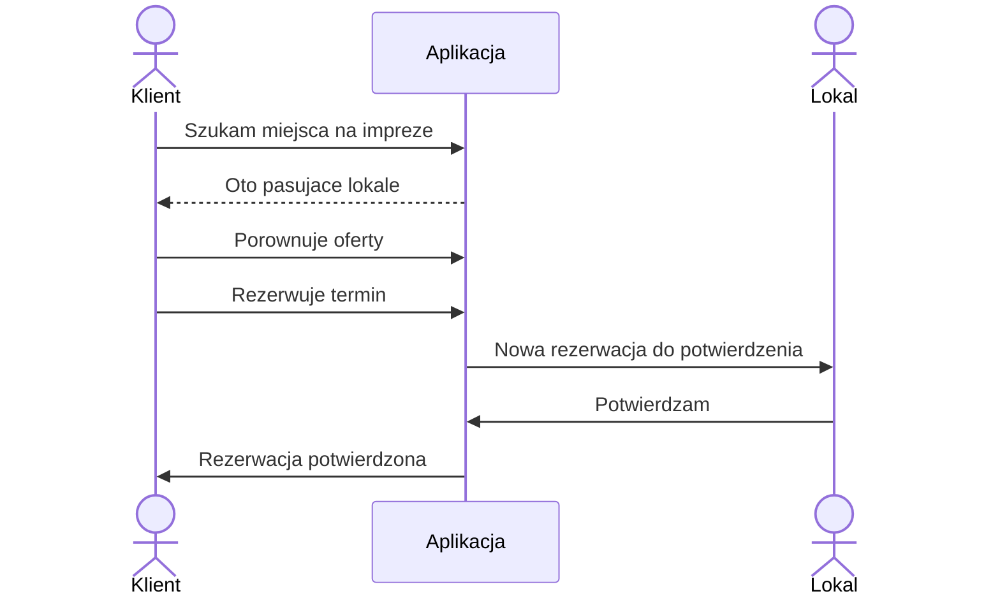

# Opis produktu — booking imprez okolicznościowych

## Po co ta aplikacja

Chcemy ułatwić organizację imprez okolicznościowych — wesela, chrzciny, komunie, imprezy firmowe, urodziny i podobne.

**Aplikacja** (strona internetowa + telefon) zbiera w jednym procesie:

1. **Dobór lokalu** — na podstawie lokalizacji, daty, liczby gości i budżetu (albo krótkiego opisu w czacie AI) dostajesz listę pasujących miejsc.
2. **Przejrzysta oferta** — każdy lokal pokazuje wolne terminy oraz cennik i menu w podobnym, ustandaryzowanym układzie, żeby dało się porównać jabłka do jabłek.
3. **Rezerwacja** — wybierasz ofertę i rezerwujesz termin w aplikacji, zamiast uzgadniać wszystko wyłącznie przez telefon i maile.
4. **Potwierdzenie od lokalu** — restauracja / sala dostaje zgłoszenie, akceptuje lub odrzuca; Ty dostajesz jasną informację zwrotną (e-mail / powiadomienie).
5. **Płatności** — cena jest jasno określona na podstawie przejrzystej oferty, a aplikacja prowadzi użytkownika przez cały proces płatności — od wpłaty zaliczki po rozliczenie końcowe.

Dla lokalu aplikacja to jednocześnie prosty panel: oferta, kalendarz i obsługa zapytań o rezerwację w jednym miejscu.

---

## Kto z tego korzysta

### Gość / organizator imprezy („Klient”)

Szuka miejsca, porównuje oferty, rezerwuje termin.

### Lokal („Restauracja”)

To może być: restauracja, hotel, dom weselny, sala bankietowa, karczma.

W aplikacji: uzupełnia ofertę, kalendarz, przyjmuje lub odrzuca rezerwacje.

---

## Jak wygląda typowa ścieżka klienta (pierwsza wersja)

1. Podaje **gdzie**, **kiedy**, **ilu gości** i opcjonalnie **budżet** (albo opisuje to w czacie z AI ). [???-tylko-chat]
2. Widzi **listę lokali**, które mają wolny termin.
3. **Porównuje** cennik i menu (w podobnym formacie — żeby dało się zestawić oferty).
4. **Rezerwuje** wybrany termin.
5. Lokal **potwierdza** (albo odmawia); klient dostaje informację e-mailem / powiadomieniem na telefon.

### Schemat — klient i lokal

### Statusy rezerwacji

- **Oczekuje** — klient wysłał prośbę, lokal jeszcze nie odpowiedział
- **Potwierdzona** — lokal zaakceptował
- **Odrzucona** — lokal odmówił
- **Anulowana** — ktoś anulował
- **Wygasła** (opcjonalnie) — lokal zbyt długo nie odpowiedział

---

## Co jest w pierwszej wersji (MVP)

MVP = minimum, żeby produkt był użyteczny i dało się go przetestować na prawdziwych użytkownikach.

### Dla klienta

- lista lokali w okolicy (filtr: miejsce, data, liczba gości, budżet)
- kalendarz wolnych terminów
- czytelny, porównywalny cennik
- czytelne, porównywalne menu
- porównanie 2–3 ofert obok siebie
- rezerwacja terminu
- pomoc w wyszukiwaniu przez czat AI („szukam sali na 80 osób pod Krakowem w czerwcu…”)

### Dla lokalu

- kalendarz zajętości / imprez
- przyjmowanie i potwierdzanie (lub odrzucanie) rezerwacji
- podstawowa oferta: cennik + menu w ustalonym formacie
- powiadomienia o nowych zapytaniach / rezerwacjach

### Logowanie

- klient i lokal logują się przez **Google** (na iPhone’ie także **Apple**)
- po zalogowaniu zapisujemy konto u nas — prowadzimy **własny rejestr użytkowników** (to nie jest „tylko Google”)

### Płatności w pierwszej wersji

- na start: **rezerwacja bez płatności w aplikacji** (zaliczka / przelew poza systemem — do potwierdzenia biznesowo)
- płatność w aplikacji (zaliczka / całość) — w kolejnych wersjach

---

## Co robimy później (nie w MVP)

### Dla klienta / organizacji imprezy

- lista gości, potwierdzenia obecności, zaproszenia
- plan sali / układ stołów
- płatność zaliczki lub całości w aplikacji
- gwarancja / ubezpieczenie płatności

### Dla lokalu

- baza „czy klient OK” (CRM), notatki
- generator ofert
- pobieranie zaliczek w aplikacji
- automatyczne przypomnienia
- statystyki sprzedaży

### Umowy i rozliczenia

- podpis elektroniczny, faktura, zadatek, płatność końcowa [???-do-zbadania]

### AI — rozszerzenia

- pomoc przy porównaniu ofert, szkic wiadomości do lokalu itd.
- szkice tworzenia materialow promocyjnych itd

---

## Jak to działa „od kuchni” (prosto)

Nie budujemy własnych serwerów od zera. Korzystamy z gotowej platformy Google: **Firebase**.

### Firebase

- Firebase to platforma Google, która oferuje gotowe usługi dla aplikacji.
- Umożliwia logowanie użytkowników (np. przez Google/Apple).
- Zapewnia bazę danych (przechowywanie danych o rezerwacjach, ofertach itp.).
- Pozwala przechowywać zdjęcia lokali.
- Obsługuje wysyłkę maili oraz powiadomień push.
- Chroni przed podwójną rezerwacją tego samego terminu.
- Dzięki Firebase większość technicznych potrzeb MVP jest dostępna od razu, bez budowania własnych serwerów.

My budujemy **to, co widzi użytkownik** (strona + aplikacja na telefon) i **zasady biznesowe** (jak działa rezerwacja, porównanie, role klient vs lokal).

### Co Firebase robi za nas (w praktyce)

| Potrzeba biznesowa | Co to znaczy dla użytkownika | Co używamy (Firebase) |
|--------------------|------------------------------|------------------------|
| Logowanie | „Zaloguj przez Google / Apple” | Logowanie Firebase |
| Rejestr kont i rezerwacji | Historia rezerwacji, dane lokalu, oferty | Baza danych Firebase (Firestore) |
| Zdjęcia lokali | Galeria na karcie restauracji | Przechowywanie plików Firebase |
| Logika rezerwacji | Status: czeka → potwierdzona / odrzucona | Automaty w chmurze (Cloud Functions) |
| Powiadomienie na telefon | „Masz nową rezerwację” / „Potwierdzono” | Powiadomienia push (FCM) |
| E-mail | Potwierdzenie na skrzynkę | Wysyłka maili przez zewnętrzną firmę (np. Resend), uruchamiana z Firebase |

## Pieniądze i koszty UTRZYMANIA (orientacyjnie) — skala ~1000 klientów

Szacunek pod **nasz case**: booking lokali, Firebase (logowanie Google/Apple, baza, zdjęcia, automaty, powiadomienia push), web + telefon, e-mail przy rezerwacji, opcjonalnie czat AI.  
To są **rzędy wielkości**, nie binding wycena — cenniki Google i firm mailowych się zmieniają.

### Założenia przy 1000 klientach

- **1000** kont klientów w rejestrze
- **ok. 50–100** lokali z ofertą i zdjęciami
- **aktywni w miesiącu:** rzędu 300–600 osób (nie wszyscy logują się codziennie)
- **rezerwacje:** ok. 200–800 / miesiąc
- **zdjęcia:** łącznie ok. 5–40 GB
- **płatności w app:** na ten moment w MVP poza aplikacją (nie liczymy prowizji bramki)

### Koszt miesięczny „utrzymania” aplikacji (po zbudowaniu)

| Pozycja | Szacunek / mies. | Komentarz przy 1000 klientach |
|---------|------------------|-------------------------------|
| Firebase (baza, logowanie, zdjęcia, automaty, push) | **5–40 USD** | Logowanie w limicie; baza i automaty zwykle nadal w darmowych progach przy rozsądnym modelu; rachunek rośnie przy ciężkich listach / złych zapytaniach albo dużym transferze zdjęć |
| Wysyłka e-maili (np. Resend) | **0–20 USD** | Przy setkach maili/mies. często wystarczy darmowy limit albo najniższy plan (~20 USD) |
| Czat AI (opcjonalnie) | **10–80 USD** | Przy większej liczbie aktywnych użytkowników czat kosztuje więcej; warto limity per użytkownik |
| Domena internetowa | **~1 USD** | Koszt roczny podzielony na miesiące |
| **Razem utrzymanie / mies.** | **ok. 20–120 USD** | Typowo **~30–60 USD**, jeśli AI jest umiarkowanie używane |

W złotówkach (orientacyjnie, kurs ~4 PLN/USD): **ok. 80–480 PLN / mies.** (częściej bliżej **120–250 PLN**, bez agresywnego AI).

**Wniosek:** przy 1000 klientach „czynsz” za Firebase nadal jest **niski względem kosztu budowy**. Większy wpływ mają maile i zwłaszcza **AI**.

### Koszty jednorazowe / roczne (poza Firebase)

- Konto dewelopera **Apple** — ok. **99 USD / rok** (żeby publikować w App Store)
- Konto dewelopera **Google Play** — ok. **25 USD** raz
- Ewentualnie firma / księgowość / prawnik RODO — osobno

### Koszty budowy - nieznane ( tools, frameworks, ux AI etc)

---

## Plan rozwoju (ogólny)

Plan roboczy pod MVP na Firebase, potem rozszerzenia. Terminy przy **1–2 osobach** budujących — orientacyjne, nie sztywny kontrakt.

### Cel końcowy MVP

Działająca ścieżka: **szukaj → porównaj → zarezerwuj → lokal potwierdza → klient dostaje info**  
(web + telefon; logowanie Google/Apple; panel lokalu; powiadomienia).

### Fazy

**Faza 0 — Ustalenia (1–2 tygodnie)**  
- domknięcie otwartych decyzji produktowych: 
- ustalenie „ustandaryzowanego” cennika i menu (jakie pola muszą być u każdego lokalu)  
- założenie projektu Firebase, konta deweloperskie (Google / Apple gdy będzie app ze sklepu)

**Faza 1 — Fundament**  
- logowanie Google (+ Apple na iOS)  
- rejestr kont (klient / lokal)  
- szkielet strony i panelu lokalu  
- baza: lokale, oferty, terminy, użytkownicy  
- upload zdjęć lokalu  

*Kamień milowy:* można się zalogować; lokal może dodać podstawowy profil.

**Faza 2 — Katalog i porównanie**  
- lista lokali z filtrami (miejsce, data, goście, budżet)  
- karty lokalu: zdjęcia, cennik, menu, kalendarz wolnych terminów  
- porównanie 2–3 ofert  

*Kamień milowy:* organizator znajduje i porównuje lokale bez rezerwacji.

**Faza 3 — Rezerwacje i powiadomienia**  
- wysłanie rezerwacji (status „oczekuje”)  
- panel lokalu: potwierdź / odrzuć  
- e-mail + powiadomienie na telefon  
- ochrona przed podwójną rezerwacją tego samego terminu  

*Kamień milowy:* pełna ścieżka happy path na danych testowych.

**Faza 4 — AI chat**  
- czat, który zamienia opis potrzeb na filtry i listę lokali z naszej bazy  
- limity użycia (żeby koszty AI były pod kontrolą)  

*Kamień milowy:* da się znaleźć lokal przez rozmowę, nie tylko formularz.  
*(Można równolegle z fazą 3 albo tuż po niej.)*

**Faza 5 — Dopracowanie i start testów**  
- poprawki UX, błędy, podstawowe zabezpieczenia  
- wersja testowa dla kilku lokali i organizatorów (soft launch)  
- publikacja: strona publiczna; app w testach sklepowych (gdy jest aplikacja na telefon ze sklepu)  

*Kamień milowy:* pierwsi prawdziwi użytkownicy testują MVP.

### Orientacyjny harmonogram
 
noidea

### Po MVP (kolejne etapy)

1. Płatności w aplikacji (zaliczka / całość) — jeśli decyzja biznesowa „tak”  
2. Więcej lokali, lepsze wyszukiwanie / mapa  
3. CRM i statystyki dla lokalu  
4. Lista gości, zaproszenia, plan sali  
5. Umowy / faktury (wbudowane lub integracja)

---

## Co jeszcze trzeba zdecydować (biznes + produkt)

Te pytania są otwarte — wpływają na zakres i budżet:

1. **Telefon:** osobna aplikacja ze sklepu (iOS/Android), wspólna technologia (np. jedna na oba systemy), czy na start wystarczy strona dobrze działająca na telefonie?
2. **Płatności:** czy w pierwszej wersji tylko rezerwacja, czy od razu zaliczka w aplikacji?
3. **Cennik:** co dokładnie porównujemy (cena za osobę, pakiet, sala + menu…)?
4. **Catering:** osobny typ firmy w aplikacji, czy tylko część oferty lokalu?
5. **Umowy i faktury:** wbudowane w produkt, czy na razie poza aplikacją / przez zewnętrzne narzędzie?
6. **Lokalizacja:** na start wystarczy wybór miasta, czy od razu mapa „w promieniu X km”?

Decyzje techniczne już zamknięte po stronie platformy: **idziemy w Firebase** (logowanie Google/Apple, baza, zdjęcia, powiadomienia, automaty w chmurze).

---

## Podsumowanie w 5 zdaniach

1. Budujemy **marketplace rezerwacji** lokali na imprezy — web + telefon.  
2. Pierwsza wersja: **szukaj → porównaj → zarezerwuj → potwierdzenie od lokalu**.  
3. Płatności, plan sali, CRM, e-podpis — **później**.  
4. Logowanie **Google** (i Apple na iPhonie); konta zapisujemy **u siebie**.  
5. Fundament techniczny: **Firebase (Google)** — szybszy start bez budowania całej infrastruktury od zera.
